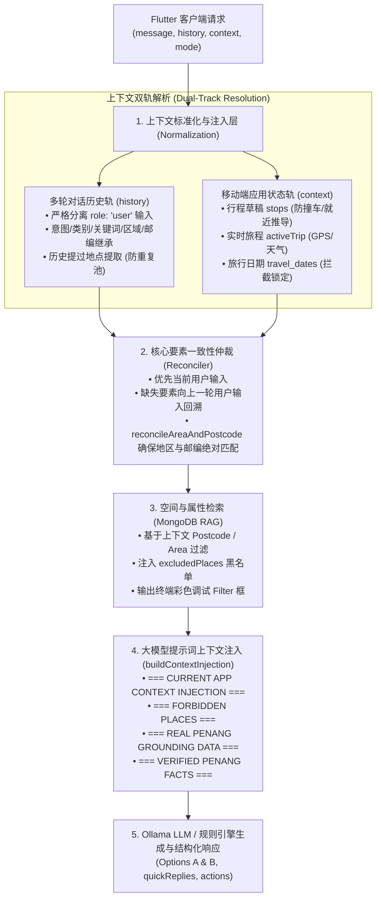

# Kia Kia Penang - Bird Backend 上下文处理机制全景技术文档

> **核心结论**：**Bird Backend 拥有极其完整、分层严密的上下文处理系统（Context Processing Pipeline）**。  
> 系统的上下文处理绝非仅仅将聊天记录简单传给大模型，而是融合了 **多轮对话历史回溯（Multi-Turn History）**、**移动端实时应用状态（App Session Context）**、**真实空间地理锚定（Spatial & RAG Grounding）** 与 **防重复排除黑名单（Anti-Duplicate Exclusion）** 的深度协同架构。

---

## 1. 上下文处理全景架构图 (Architecture Overview)



---

## 2. 多轮对话上下文 (`history`) 的深度处理

客户端发送的 `history` 结构如下：
```json
[
  { "role": "user", "content": "Recommend good cafes in George Town" },
  { "role": "assistant", "content": "[Option A]: ChinaHouse...", "suggestedPlaces": [...] },
  { "role": "user", "content": "what about Balik Pulau?" }
]
```

### 2.1 真实用户输入分离与反污染机制 (Anti-Pollution Guard)
在早期的版本中，如果不加区分地检索历史文本，Assistant 之前回复的文本（如提到 `ChinaHouse tiramisu cake and bakery`）会污染下一轮的意图，导致用户询问浮罗山背时被错误当成搜索蛋糕店。

**当前后端的防护机制**：
- 实现 `getAllPreviousUserInputs(history)` 与 `getPreviousUserInput(history)`，**严格过滤只提取 `role === 'user'` 的文本**。
- Assistant 回复的词汇**绝对不会**进入意图分类、关键词提取与搜索分类的判断池。

---

### 2.2 四要素「当前优先、缺一回溯」继承机制 (Fallback Inheritance)

针对用户的每一轮输入，后端会独立解析 **4 个核心要素**：
1. **`intent`**（用户意图：推荐 `RECOMMENDATION_REQUEST`、事实问询 `FACTUAL_INQUIRY`、行程操作 `ITINERARY_ACTION`）
2. **`keywords` / `category`**（目标类别与关键词：如 `Cafes`、`beaches`、`food`）
3. **`target area`**（目标区域：如 `George Town`、`Balik Pulau`）
4. **`target postcode`**（目标 5 位邮编：如 `10000`、`11000`）

#### 继承执行逻辑矩阵：
| 场景 | Turn 1 输入 | Turn 2 输入 | Turn 2 解析结果与上下文继承逻辑 |
| :--- | :--- | :--- | :--- |
| **场景 A：仅切换地区** | *"Recommend good cafes in George Town"* | *"what about Balik Pulau?"* | • **Intent**: 继承 `RECOMMENDATION_REQUEST`<br/>• **Keywords**: 继承 `['Cafes']`<br/>• **Area**: 当前覆盖为 `Balik Pulau`<br/>• **Postcode**: 自动对齐为 `11000` |
| **场景 B：索取更多选项** | *"Suggest places to visit in Balik Pulau"* | *"give me more options"* | • **Intent**: 继承 `RECOMMENDATION_REQUEST`<br/>• **Keywords**: 继承上一轮通用探索<br/>• **Area**: 继承 `Balik Pulau`<br/>• **Postcode**: 继承 `11000` |
| **场景 C：当前显式覆盖** | *"Recommend cafes in George Town"* | *"Show me beaches in Batu Ferringhi"* | • **Intent**: `RECOMMENDATION_REQUEST`<br/>• **Keywords**: 当前覆盖为 `['beaches']`<br/>• **Area**: 当前覆盖为 `Batu Ferringhi`<br/>• **Postcode**: 当前对齐为 `11100`（前轮完全不残留） |
| **场景 D：多轮转为问答** | *"Recommend cafes in George Town"* | *"What time does Kek Lok Si close?"* | • **Intent**: 当前具备明确营业时间特征，判定为 `FACTUAL_INQUIRY`，终止地点推荐流程，转入极乐寺事实检索 |

---

### 2.3 历史防重复排除池 (`extractHistoryMentionedPlaces`)
为避免小鸟反复推荐用户已经看过的地点，后端建立了**动态黑名单上下文**：
```javascript
function extractHistoryMentionedPlaces(history = [], context = {}) {
    const mentioned = new Set();
    // 1. 抓取行程草稿与活跃行程里的所有已安排地点
    // 2. 扫描历史聊天中出现的 [Option A]、[Option B]
    // 3. 扫描历史消息中的 Markdown 粗体地点名 (**Place Name**)
    // 4. 扫描历史 quickReplies 与 suggestedPlaces
    return mentioned; // 汇入 excludedPlaces
}
```
该集合直接注入 MongoDB 查询条件与大模型提示词，确保接下来的回复**百分之百提供全新的备选项**。

---

### 2.4 用户指代消解与选项回溯 (Option & Reference Resolution)
当小鸟给出：
- `[Option A]: Audi Dream Farm`
- `[Option B]: Bao Sheng Durian Farm`

若用户下一轮输入包含：
- `"Option A"`、`"Option 1"`、`"add this"`、`"帮我加入第一个"`

后端会通过上下文快速解析上一轮返回的 `suggestedPlaces[0]`，直接将其打包为结构化操作负载（`action: 'add_spot'`，携带完整的经纬度、地址、类别），返回给前端直接加入行程。

---

## 3. 移动端应用状态上下文 (`context`) 的深度处理

前端每次发起 `/api/bird/chat` 请求时，会携带丰富的客户端状态对象 `context`：

```typescript
{
  "userId": "vennis_01",
  "mode": "draft_modifier",          // 模式: global_explorer | draft_modifier | in_trip_assistant
  "hasActiveTrip": false,
  "travel_dates": {
    "start_date": "2026-10-05",
    "end_date": "2026-10-07"
  },
  "draftPlan": {
    "scheduleDate": "2026-10-05",
    "stops": [
      {
        "sequence": 1,
        "placeName": "Cheong Fatt Tze - The Blue Mansion",
        "category": "cultural & heritage",
        "area": "George Town",
        "address": "14, Leith Street, 10200 George Town"
      }
    ]
  },
  "activeTrip": {
    "tripId": "trip_9988",
    "currentStopIndex": 1,
    "currentCoordinates": { "lat": 5.414, "lng": 100.328 },
    "liveWeather": {
      "condition": "Heavy Rain",
      "temperature": 28,
      "precipitationProbability": 85
    },
    "remainingStops": [...]
  }
}
```

### 3.1 行程草稿上下文 (`draftPlan`) 的 3 大作用
1. **草稿去重防撞车**：
   - 提取草稿内所有景点的中英文名称。若用户草稿里已有蓝屋（The Blue Mansion），小鸟绝不会在后续选项中再次推荐蓝屋。
2. **地理空间就近推导（Anchor Proximity）**：
   - 如果用户只是说 *"加多个景点"*，既没说地区也没给邮编，系统会自动读取 `draftPlan.stops` 中**最近添加的最后一个停靠点**（如 Stop 1 位于 George Town `10200`），将下一站的目标区域自动锁定在 George Town，防止跨海或跨区跳跃。
3. **行程保存里程碑触发（Milestone Nudge）**：
   - 当检测到 `draftPlan.stops.length >= 3`，且用户尚未设置旅行日期（`travel_dates` 为空）时，后端会自动提示用户锁定行程日期，避免行程草稿遗失。

---

### 3.2 旅途中助手上下文 (`activeTrip`) 的实时响应
当应用处于 `in_trip_assistant` 模式时：
1. **GPS 坐标感知**：
   - 读取 `currentCoordinates`，若用户说 *"附近有什么好吃的"*，直接以用户当前 GPS 所在的真实位置计算就近商户。
2. **实时天气自适应重规划（Live Weather Adaptation）**：
   - 读取 `liveWeather.condition` 与降雨概率 `precipitationProbability`。
   - 若检测到下雨天（Rain / Thunderstorm），后端在检索推荐时自动优先筛选室内景点（Museums, Shopping Malls, Cafes），避开户外海滩或徒步路线。

---

### 3.3 模式分流器 (`mode`) 对上下文的处理差异

| 运行模式 (`mode`) | 主要交互场景 | 上下文重点处理逻辑 |
| :--- | :--- | :--- |
| **`global_explorer`** | 发现页、小鸟自由聊天 | • 专注于解答槟城文化历史、景点介绍与开放式灵感推荐。<br/>• 默认不生成添加至行程的操作按钮。 |
| **`draft_modifier`** | 行程规划页、修改草稿 | • 紧密监控 `draftPlan.stops` 与 `travel_dates`。<br/>• 每次推荐后输出 `suggest_spots` 或 `add_spot` 结构化动作指令。 |
| **`in_trip_assistant`** | 已出行页面、实时导航中 | • 紧密结合 `currentCoordinates`、剩余站点及实时天气。<br/>• 专注于就近求助、突发避雨或调整下一站顺序。 |

---

## 4. 大模型提示词上下文注入格式 (`buildContextInjection`)

收集完上述所有上下文后，后端通过 `buildContextInjection()` 将它们结构化组装，动态拼装入大模型的系统提示词中：

```text
=== CURRENT APP CONTEXT INJECTION ===
- User ID: vennis_01
- Draft Plan Schedule Date: 2026-10-05
- Draft Plan Stops (1 total):
  * Stop 1: "Cheong Fatt Tze - The Blue Mansion" (Category: cultural & heritage, Arrival: Flexible, Stay: 60m, WeatherTag: None)

=== FORBIDDEN / PREVIOUSLY SUGGESTED OR DRAFTED PLACES ===
STRICT RULE: The user already has or has recently seen these places: ["cheong fatt tze - the blue mansion", "audi dream farm"]. You MUST NOT suggest, recommend, or mention any of these places as Option A or Option B. You MUST suggest completely fresh alternatives!

=== REAL PENANG GROUNDING DATA (2 places found in George Town) ===
CRITICAL MANDATORY RULES:
1. ALWAYS PROVIDE TWO CHOICES: You MUST ALWAYS provide EXACTLY two options formatted as [Option A] and [Option B]! Never provide only one option.
2. STRICT LOCAL AREA ANCHOR: The user is planning / exploring in George Town. Both [Option A] and [Option B] MUST strictly be located in George Town!
3. ZERO MAINLAND CROSSING: NEVER suggest places in Bukit Mertajam, Butterworth, or Seberang Perai when user is in George Town or on Penang Island!
4. NAME SPECIFIC VENUES: Name Grounding Option A as [Option A] and Grounding Option B as [Option B] exactly as provided below.

[Option A Grounding - "Pinang Peranakan Mansion"]:
  - Name: "Pinang Peranakan Mansion"
  - Area: "George Town"
  - Category: "cultural & heritage"
  - Address: "29, Church St, 10200 George Town"
  - Business Hours: {"monday":"9:30 AM - 5:00 PM", ...}
  - Summary: "Opulent Baba Nyonya heritage residence filled with antiques."

[Option B Grounding - "Chew Jetty"]:
  - Name: "Chew Jetty"
  - Area: "George Town"
  - Category: "cultural & heritage"
  - Address: "Weld Quay, 10300 George Town"
  - Business Hours: "Open daily 9:00 AM - 9:00 PM"
  - Summary: "Historic 19th-century wooden stilt clan settlement over water."
=====================================
```

---

## 5. 控制台实时上下文调试日志 (Terminal Debugging)

每当一次请求执行时，后端都会在终端打印完整的上下文解析流程与 MongoDB 过滤条件，方便开发排查：

```text
╔══════════════════════════════════════════════════════════════════════════════╗
║ 📥 [BIRD AI CHAT REQUEST RECEIVED]
║ Mode: draft_modifier
║ User Input: "what about Balik Pulau?"
║ History Turns: 4 messages
║ Draft Plan Stops: 1 stops
╠──────────────────────────────────────────────────────────────────────────────╣
║ 🔍 [INTENT & KEYWORD EXTRACTION PIPELINE]:
║   • Intent Classification: RECOMMENDATION_REQUEST (Inherited from turn 1)
║   • Extracted Keyword(s): ["Cafes"] (Inherited from turn 1)
║   • Target Postcode: 11000 (Resolved from Balik Pulau)
║   • Target Area / Vicinity: Balik Pulau
║   • Excluded Places (Anti-Duplicate): [cheong fatt tze, chinahouse...]
╠──────────────────────────────────────────────────────────────────────────────╣
║ 📚 [DATA HANDLING & GROUNDING: RAG vs. MODEL INTELLIGENCE]:
║   • Execution Path: 🟢 DETERMINISTIC RAG GROUNDING (DB / Fast Intent)
║   • Grounding Source: MongoDB (places_new collection)
║   • Actual MongoDB Query Filter(s):
┏━━━━━━━━━━━━━━━━━━━━━━━━━━━━━━━━━━━━━━━━━━━━━━━━━━━━━━━━━━━━━━━━━━━━━━━━━┓
┃ 🔍 [MongoDB places_new Query Filter - Postcode: 11000]                  ┃
┗━━━━━━━━━━━━━━━━━━━━━━━━━━━━━━━━━━━━━━━━━━━━━━━━━━━━━━━━━━━━━━━━━━━━━━━━━┛
{
  "status": "active",
  "$and": [
    {
      "$or": [
        { "address": { "$regex": "\\b11000\\b", "$options": "i" } },
        { "place_address": { "$regex": "\\b11000\\b", "$options": "i" } }
      ]
    },
    { "primary_category": "Cafes" }
  ]
}
✔ [MongoDB Result - Postcode: 11000]: Found 6 records (2 fresh after exclusions)
╚══════════════════════════════════════════════════════════════════════════════╝
```

---

## 6. 总结 (Summary)

Bird Backend 的上下文处理实现了**四个维度的严密防护与融合**：
1. **输入意图上下文**：通过分离 User 与 Assistant，确保意图、类别、地区、邮编**当前优先、缺失才回溯**，且不被历史废话污染。
2. **应用状态上下文**：深度融合草稿计划（去重防撞车、末尾景点就近锚定）与当前活跃行程（GPS 坐标、降雨天气重选）。
3. **空间一致性保障**：强制执行 `reconcileAreaAndPostcode`，确保查询到 MongoDB 的 Postcode 与 Area 始终严格一致。
4. **大模型接地保障**：将结构化上下文转换为不可违背的 System Prompt 与真实的 Grounding 数据，保证推荐的景点百分之百真实存在且切合当前情境。
