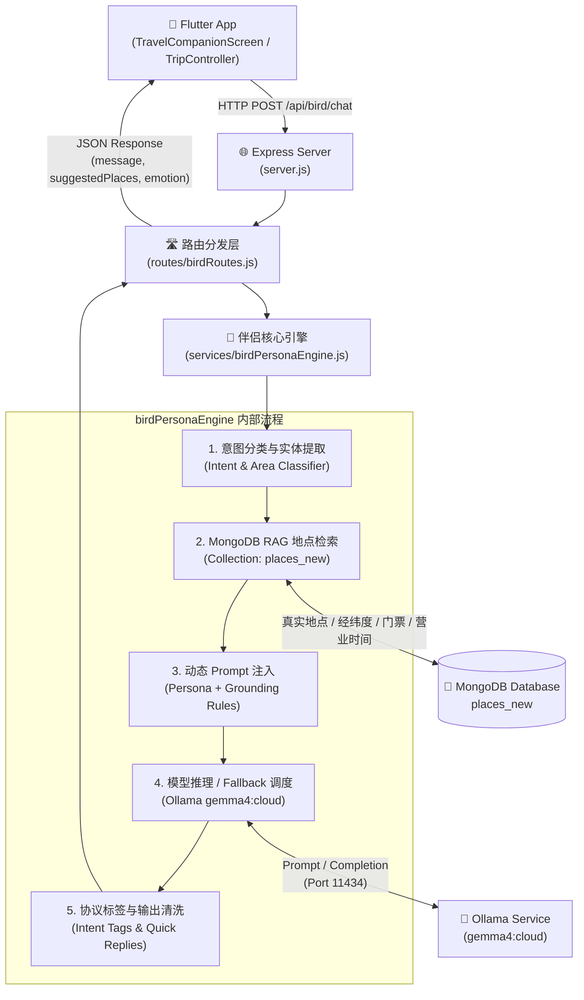
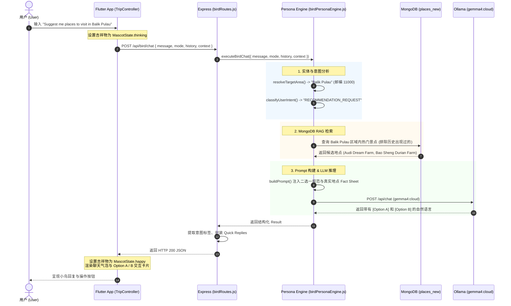

# 🦜 Kia-Kia Penang Travel Bird 后端运行机制与架构详解

本文档详细拆解 **Kia-Kia Travel Companion（粉色小鸟伴侣）** 后端的完整运行原理、数据流向、RAG 检索逻辑以及真实运行示例。

---

## 一、 系统架构总览 (System Architecture)

Travel Bird 后端采用了 **Node.js (Express) + MongoDB (places_new) + 本地 Ollama LLM (gemma4:cloud) + 确定性 RAG 兜底引擎** 的混合架构：



### 核心组成模块

| 模块 | 所在路径 / 技术栈 | 职责 |
| :--- | :--- | :--- |
| **前端状态控制器** | `lib/controllers/trip_controller.dart` | 负责与后端的 HTTP 通信、聊天气泡历史维护、吉祥物动画状态控制（`MascotState`） |
| **后端入口** | `places-loader/server.js` | 监听端口（默认 3000），挂载 `/api/bird` 路由 |
| **路由层** | `places-loader/routes/birdRoutes.js` | 接收请求参数，处理用户旅行日期上下文，格式化返回的 JSON 结构，提取意图标签 |
| **智能人设引擎** | `places-loader/services/birdPersonaEngine.js` | **核心大脑**（超 4,300 行）。负责意图分类、区域锁定、MongoDB 真实数据检索 (RAG)、System Prompt 拼装、Ollama 调用与本地规则兜底 |
| **地点数据库** | MongoDB 集合 `places_new` | 存储 Penang 全岛与大陆经过清洗校验的真实 POI 数据（包括 5 位邮编、分类、经纬度、营业时间等） |
| **LLM 推理端** | Ollama (`http://...:11434/api/chat`) | 部署运行 `gemma4:cloud`，赋予小鸟生动、地道槟城风味的回复语言 |

---

## 二、 小鸟伴侣的三种工作模式 (Operational Modes)

伴侣在不同的旅行阶段会自动切换至不同模式：

1. **`global_explorer`（全岛探索模式 - 默认）**：
   - 适用于自由问答、探索槟城各个区域、寻找美食或特定类型景点。
   - 规则：严格遵守 **“二选一原则”（[Option A] vs [Option B]）**，避免用户选择困难。
2. **`draft_modifier`（草稿规划模式）**：
   - 当用户正在组装临时行程草稿时启用。
   - 支持通过聊天直接添加景点（`add_spot`）、删除景点（`remove_spots`）、解释游玩时间逻辑（`explain_times`）。
   - **里程碑主动触发**：当草稿景点达到 3 个且尚未锁定日期时，小鸟会主动提示保存并引导进入日期选择。
3. **`in_trip_assistant`（在途实时伴侣模式）**：
   - 用户已锁定行程且正在实地游览时启用。
   - 结合实时天气（Weather Guard）检测降雨，突发降雨时主动提示室内备选方案；靠近特定打卡点时提醒收集数字文化印章。

---

## 三、 完整运行实例剖析

### 场景示例：用户输入 `"Suggest me places to visit in Balik Pulau"`

以下是系统从接收到输入到最终在前端渲染的每一步细节：



---

### 详细步骤分解

#### 步骤 1：前端发起请求 (Flutter -> Backend)
在 `TravelCompanionScreen` 中，用户点击发送，`TripController.sendMessage()` 触发：
- 吉祥物小鸟状态切换为 `MascotState.thinking`（小鸟做出思考动画）。
- 发送 HTTP `POST http://<IP>:3000/api/bird/chat`，请求体如下：

```json
{
  "message": "Suggest me places to visit in Balik Pulau",
  "mode": "global_explorer",
  "history": [],
  "context": {
    "draftSpotCount": 0,
    "draftPlaces": []
  },
  "hasActiveTrip": false,
  "travel_dates": null
}
```

---

#### 步骤 2：路由处理与上下文规范化 (`birdRoutes.js`)
- 检查消息非空。
- 补全 `enrichedContext`（检查用户是否已设定旅行日期、当前是否有正在进行的行程等）。
- 将参数传递给核心方法 `executeBirdChat()`。

---

#### 步骤 3：意图分类与目标区域提取 (`birdPersonaEngine.js`)
引擎对用户的自然语言进行解析：
1. **目标区域识别**：`resolveTargetArea()` 检测到文本包含关键词 `"balik pulau"`，将其标准化为 `'Balik Pulau'`，并映射至其专属 5 位邮编范围（`11000`）。
2. **意图类型分类**：`classifyUserIntent()` 识别出该问题为推荐请求（`RECOMMENDATION_REQUEST`），而非纯事实问答（如“门票多少钱”、“营业时间”）。因此系统确定需要执行 **真实地点推荐流程**。

---

#### 步骤 4：基于 MongoDB 的真实地点检索 (RAG Grounding)
引擎调用 `findRelevantPlaces()`：
1. **构造数据库查询**：
   - 目标区域锁定：`area: "Balik Pulau"` 或 `address: /11000/`。
   - 类别匹配：优先农家乐/生态休闲/自然公园（`Agro-Tourism`, `Nature & Parks`, `Heritage & Culture`）。
   - 去重过滤：排除用户聊天历史或当前行程中已经存在的地点（`excludedPlaces`）。
2. **候选地点锁定（严格两选一）**：
   从数据库中选出两个最优质、最能代表浮罗山背（Balik Pulau）特色的地点：
   - **地点 1 (Option A)**: `Audi Dream Farm`（自然农场，亲子喂养小动物与生态花园）
   - **地点 2 (Option B)**: `Bao Sheng Durian Farm`（宝盛榴莲园，著名山顶果园与俯瞰山景）
3. **地理防跨海守卫 (Zero Mainland Crossing)**：
   系统严格拦截大陆区（如大山脚 Bukit Mertajam、北海 Butterworth）的地点，确保推荐景点绝对位于浮罗山背本土。

---

#### 步骤 5：动态 System Prompt 组装与注入
系统调用 `buildPrompt()`，将小鸟人设与从数据库检索到的地点事实注入到模型的系统指令中：

```text
=== SYSTEM PROMPT 核心注入内容（简要示例） ===
Role: You are Penang Travel Bird (槟城导游小鸟伴侣), charming, warm and knowledgeable.
Allowed Local Slang: Use max 1 per response (e.g. "Jom", "Ho chiak"). Never use "lah", "lor".
Guardrail: You MUST ALWAYS provide EXACTLY two options grounded in the data below:

[DATA GROUNDING]:
Grounding Option A: Audi Dream Farm (Scenic countryside farm with friendly petting animals...)
Grounding Option B: Bao Sheng Durian Farm (Famous hillside durian orchard with breathtaking mountain views...)

Format Requirement:
[Option A]: **Audi Dream Farm** - <Short highlight>
[Option B]: **Bao Sheng Durian Farm** - <Short highlight>
Keep the total response under 70 words!
```

---

#### 步骤 6：LLM 推理与安全兜底 (Ollama / Fallback)
1. **LLM 调用**：向 Ollama 发送请求（使用 `gemma4:cloud`，温度值设为 `0.3` 以确保输出严谨稳定）。
2. **离线与超时兜底 (Deterministic Fallback)**：
   - 如果 Ollama 服务正常，模型将生成符合格式的生动回复。
   - 如果 Ollama 响应超时（>15秒）或断网，引擎会自动切换到**确定性规则引擎**，直接利用 MongoDB 抽取的两个地点生成预置文案，**保证前端绝对不会收到 500 错误或空白无响应**。

---

#### 步骤 7 & 8：后端 Expected Output (完整真实响应结构)

后端向 Flutter 返回状态码 `200 OK`，JSON 内容如下：

```json
{
  "success": true,
  "mode": "global_explorer",
  "message": "Flap flap! Jom explore the peaceful countryside of Balik Pulau! Here are two wonderful spots for you:\n\n[Option A]: **Audi Dream Farm** - Enjoy petting friendly farm animals and peaceful countryside gardens.\n\n[Option B]: **Bao Sheng Durian Farm** - Experience a scenic hillside orchard with breathtaking mountain views and famous durian tasting.\n\nWhich one would you like to visit first? 🚲✨",
  "reply": "Flap flap! Jom explore the peaceful countryside of Balik Pulau! Here are two wonderful spots for you:\n\n[Option A]: **Audi Dream Farm** - Enjoy petting friendly farm animals and peaceful countryside gardens.\n\n[Option B]: **Bao Sheng Durian Farm** - Experience a scenic hillside orchard with breathtaking mountain views and famous durian tasting.\n\nWhich one would you like to visit first? 🚲✨",
  "action": "suggest_spots",
  "emotion": "happy",
  "isFactualInquiry": false,
  "payload": {
    "hasTravelDates": false,
    "draftSpotCount": 0
  },
  "quickReplies": [
    "Option A",
    "Option B"
  ],
  "suggestedPlaces": [
    {
      "id": "66f1a8c3d9a1e2001a1b2c34",
      "name": "Audi Dream Farm",
      "category": "Attraction / Agro-Tourism",
      "description": "Scenic countryside farm with friendly petting animals, birds, and lush plantation gardens in Balik Pulau.",
      "area": "Balik Pulau",
      "lat": 5.3525,
      "lng": 100.2180,
      "images": [
        "https://.../audi_dream_farm.jpg"
      ]
    },
    {
      "id": "66f1a8c3d9a1e2001a1b2c35",
      "name": "Bao Sheng Durian Farm",
      "category": "Attraction / Agro-Tourism",
      "description": "Famous hillside durian orchard with breathtaking mountain views and authentic durian experiences in Balik Pulau.",
      "area": "Balik Pulau",
      "lat": 5.3850,
      "lng": 100.2070,
      "images": [
        "https://.../bao_sheng.jpg"
      ]
    }
  ],
  "options": [
    "Option A",
    "Option B"
  ],
  "model": "gemma4:cloud"
}
```

---

#### 步骤 9：Flutter 前端呈现与后续交互

当 Flutter 收到上述 JSON 后：
1. **吉祥物表情切换**：根据 `emotion: "happy"`，粉色小鸟切换为开心的动态姿态（`MascotState.happy`）。
2. **气泡渲染**：将 `message` 解析为 Markdown 聊天气泡，高亮显示 **Audi Dream Farm** 与 **Bao Sheng Durian Farm**。
3. **快捷回复 Chips**：输入框上方显示 `[Option A]` 和 `[Option B]` 胶囊按钮。
4. **闭环交互**：
   - 当用户点击 **`[Option A]`** 时，前端自动发出消息 `"Option A"`。
   - 后端 `birdPersonaEngine` 捕获到该选项，并自动识别出指的是上一轮对话推荐的 **Audi Dream Farm**，随即返回 `action: "add_spot"`，自动将该地点加入用户的行程草稿中！

---

## 四、 核心设计准则与安全机制 (Guardrails)

1. **严格两选一原则 (Strict 2 Options)**：
   - 移动端屏幕有限，若返回 5-10 个地点容易造成认知负担。系统严格限制推荐数量为两个，直截了当。
2. **零幻觉原则 (Strict Zero Hallucination via RAG)**：
   - 所有推荐地点必须存在于 MongoDB 的 `places_new` 真实集合中，绝不允许 LLM 凭空编造不存在的店铺或景点。
3. **区域一致性与防跨海守卫 (Geographic Integrity)**：
   - 槟城分为槟岛（Island）与威省（Mainland），两者跨海交通成本极高。系统具备区域锚定机制，询问浮罗山背（Balik Pulau）时，坚决不夹带乔治市对岸的大陆景点。
4. **问答与推荐精准分离**：
   - 若用户询问纯事实（如“极乐寺门票多少钱”、“营业时间”），系统进入 `FACTUAL_INQUIRY` 路径，只回答具体事实，**绝不强塞 Option A / Option B 推荐卡片**。
   - 只有在探索、推荐需求时，才激活二选一卡片。
