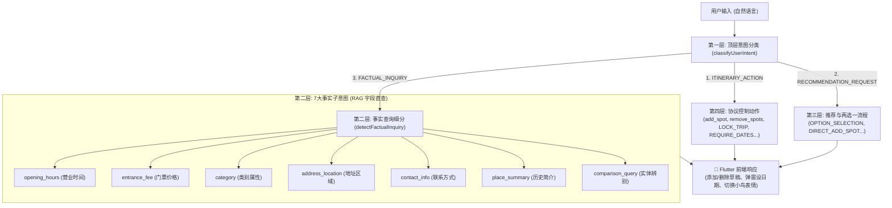

# 🧭 Kia-Kia Travel Bird 意图分类体系全景指南 (Intent Classification Guide)

本文档系统盘点并详细拆解 **Kia-Kia Penang Travel Companion (导游小鸟伴侣)** 体系内的所有意图分类（Intent Classification）。

整个系统的意图识别采用了 **分层级、多维度、端到端闭环** 的架构设计，从**顶层用户输入分类**，到**事实查询细分**，再到**执行流分流**与**跨端通信协议动作**。

---

## 目录
1. [意图分层全景图](#一-意图分层全景图)
2. [第一层：顶层用户输入意图 (Top-Level User Intent)](#二-第一层顶层用户输入意图-top-level-user-intent)
3. [第二层：客观事实问答细分子意图 (Factual Inquiry Sub-Intents)](#三-第二层客观事实问答细分子意图-factual-inquiry-sub-intents)
4. [第三层：执行流与追踪意图 (Runtime & Trace Intent Types)](#四-第三层执行流与追踪意图-runtime--trace-intent-types)
5. [第四层：端到端跨端协议控制动作 (Trip Protocol Actions)](#五-第四层端到端跨端协议控制动作-trip-protocol-actions)
6. [第五层：草稿规划二次确认子类型 (Draft Confirmation Types)](#六-第五层草稿规划二次确认子类型-draft-confirmation-types)
7. [意图统计汇总表](#七-意图统计汇总表)

---

## 一、 意图分层全景图

---

## 二、 第一层：顶层用户输入意图 (Top-Level User Intent)

在 [`birdPersonaEngine.js`](file:///c:/Users/Vennis/OneDrive/Desktop/0824-setup-mongoDB-places-table-nodejs/places-loader/services/birdPersonaEngine.js#L245) 的核心分类器 `classifyUserIntent(text)` 中，系统将所有用户输入归入 **3 大顶层类别**：

### 1. `ITINERARY_ACTION` (行程操作意图)
* **定义**：用户意图对当前的旅行计划/草稿进行增、删、改、锁、存等实质性操作。
* **典型输入示例**：
  - *"Add this to my plan"* / *"帮我加入行程"* / *"Add option A"*
  - *"Delete spot 2"* / *"Remove the market"* / *"清空行程"*
  - *"Save and plan trip for me now"* / *"Lock itinerary"*
* **触发后行为**：直接进入行程修改逻辑，不调用常规问答检索。

### 2. `RECOMMENDATION_REQUEST` (推荐与探索意图)
* **定义**：用户寻求景点、美食、游玩建议、周边探索或两两对比。
* **典型输入示例**：
  - *"Suggest me places to visit in Balik Pulau"*
  - *"Any good cafes in George Town?"* / *"推荐一些好吃的"*
  - *"What are the best places nearby?"* / *"附近有什么好玩的"*
  - *"Bayan Lepas or Balik Pulau?"* (区域对比)
* **触发后行为**：触发 MongoDB RAG 检索并**严格生成 [Option A] 和 [Option B]** 两选一卡片。

### 3. `FACTUAL_INQUIRY` (事实查询与问答意图)
* **定义**：用户询问某一客观事实（如时间、价格、位置、背景、健康/食用禁忌）。
* **典型输入示例**：
  - *"What time does Kek Lok Si close?"* / *"极乐寺几点关门？"*
  - *"How much is the ticket for Entopia?"* / *"需要门票吗？"*
  - *"Can pregnant women drink nutmeg juice?"* / *"孕妇可以喝豆蔻水吗？"*
* **触发后行为**：直接检索 MongoDB 字段或事实知识库回答，**绝不生成 Option A / Option B 推荐**，保持回答简练准确（< 35字）。

---

## 三、 第二层：客观事实问答细分子意图 (Factual Inquiry Sub-Intents)

在 `detectFactualInquiry(text)` 中，当顶层被判定为客观事实问答时，细分为 **7 种具体数据字段意图**，精准映射至 MongoDB `places_new` 集合：

| 子意图代码 | 中文名称 | 关键词识别匹配 (En / Zh) | 映射 MongoDB 字段 |
| :--- | :--- | :--- | :--- |
| **`opening_hours`** | **营业 / 开放时间** | opening hour, operating hour, what time open/close, 几点开, 几点关, 营业时间, 开放时间, 今天有开吗 | `opening_hours_text`, `business_hours` |
| **`entrance_fee`** | **门票 / 收费价格** | entrance fee, admission, ticket price, how much to enter, is it free, 门票, 多少钱, 要门票吗, 免费吗, 收费标准 | `price_level` |
| **`category`** | **类别 / 性质归属** | category, what type of place, is it a cafe/temple/museum, 分类, 属于什么类别, 是什么店, 属于哪种 | `primary_category`, `sub_categories` |
| **`address_location`** | **地址 / 区域位置** | which area, where is it, exact address, location, 在哪个区, 在哪里, 具体地址, 怎么去, 属于哪个市 | `address`, `area`, `place_location` |
| **`contact_info`** | **联系电话 / 官网** | phone number, contact, official website, 电话, 联系电话, 官网, 网址, 联系方式 | `phone`, `website` |
| **`place_summary`** | **历史简介 / 背景来历** | tell me about, history of, background, who built, 介绍一下, 历史背景, 来历, 有什么故事, 简介 | `summary`, `description` |
| **`comparison_query`** | **实体鉴别 / 辨别差异** | is the same as, difference between, are they the same, 是一样吗, 是同一个吗, 有什么区别 | 跨地点属性比对与去歧义 |

---

## 四、 第三层：执行流与追踪意图 (Runtime & Trace Intent Types)

在 `executeBirdChat` 运行时，后端通过 `trace.intentType` 记录每一次请求的具体执行分支（共 **6 种**），用于性能追踪与调度决策：

1. **`SYSTEM_ACTION`**：
   - 快速系统动作分发（如点击了“保存并优化”或“继续探索”）。
2. **`OPTION_SELECTION`**：
   - 选定上一轮推荐的选项（如输入 `"Option A"`, `"Option B"`, `"Add both"`, `"1"`, `"2"`）。
3. **`DIRECT_ADD_SPOT`**：
   - 包含明确具体地名的直加指令（例如 *"I want to visit Penang Hill"* 或 *"Add Kek Lok Si"*）。
4. **`RECOMMENDATION_REQUEST`**：
   - 常规 RAG 推荐流程，检索并格式化两个选项。
5. **`FACTUAL_INQUIRY`**：
   - 单点事实查询流程，精准提取属性并以极简自然语言返回。
6. **`GENERAL_INQUIRY`**：
   - 兜底通用问答与闲聊（默认初始态）。

---

## 五、 第四层：端到端跨端协议控制动作 (Trip Protocol Actions)

后端返回给 Flutter 前端的 `action` 字段（以及 Prompt 协议标签 `[INTENT: ...]`）包含 **6 种端到端协议动作**：

| Protocol Action 代码 | 对应 Prompt 标签 | 触发场景 | Flutter 前端响应 (`trip_controller.dart`) |
| :--- | :--- | :--- | :--- |
| **`add_spot`** | *(模型自动解析)* | 用户选择或要求添加某一具体地点 | 提取地点信息加入 `_draftItinerary` 草稿，小鸟切换为开心表情 (`MascotState.happy`) |
| **`remove_spots`** | *(模型自动解析)* | 用户提出删除某序号或名称的景点 | 从草稿中移除指定序号的景点 (`targetSequences`) |
| **`suggest_spots`** | *(推荐流程默认)* | 用户要求推荐或探索新地方 | 渲染 Option A/B 气泡，并在输入框上方生成对应快捷胶囊按钮 |
| **`REQUIRE_DATES`** | `[INTENT: REQUIRE_DATES]` | 用户试图锁定/保存行程但尚未设定旅行日期 | 阻断保存，回调 `onRequireDatesTriggered` 弹出日期选择器，按钮变为“Select Dates 📅” |
| **`LOCK_TRIP`** | `[INTENT: LOCK_TRIP]` | 日期已设定且行程确认无误，行程正式锁定 | 调用 `lockAndStartTrip()` 启动在途向导，小鸟切换为成功表情 (`MascotState.success`) |
| **`CANCEL_TRIP`** | `[INTENT: CANCEL_TRIP]` | 用户主动要求放弃或重置当前正在进行的行程 | 调用 `cancelActiveTrip()` 清空状态，小鸟切换为难过表情 (`MascotState.sad`) |

---

## 六、 第五层：草稿规划二次确认子类型 (Draft Confirmation Types)

在 `draft_modifier`（草稿规划模式）下，当系统需要向用户发起二次确认时，`payload.confirmationType` 支持 **4 种确认子意图**：

1. **`proactive_save_nudge` (满3个景点主动保存提示)**：
   - 当草稿景点累积达到 3 个且未设定日期时，小鸟主动弹出保存引导，提供快捷回复：`["🚀 Save and Plan Trip for Me Now", "➕ Add More Places"]`。
2. **`remove_ambiguous` (模糊删除消除歧义)**：
   - 用户说“删除那个夜市”，但草稿中有多个类似地点时触发，提供二选一确认：`["Option A: Remove Spot 1", "Option B: Remove Spot 2"]`。
3. **`schedule_conflict` (路线/时间冲突确认)**：
   - 所选地点跨越海峡（如从槟岛临时插入威省大山脚）或时间明显冲突时提醒。
4. **`replace_spot` (地点替换确认)**：
   - 用户希望用新景点替换掉已有草稿中的某一个景点。

---

## 七、 意图统计汇总表

| 维度 / 层级 | 涵盖意图数量 | 核心功能 | 代表意图 / 关键词 |
| :--- | :---: | :--- | :--- |
| **第一层：顶层用户输入意图** | **3** 种 | 决定整体交互逻辑分支 | `ITINERARY_ACTION`, `RECOMMENDATION_REQUEST`, `FACTUAL_INQUIRY` |
| **第二层：事实查询细分子意图** | **7** 种 | 精准定位 MongoDB 字段直查 | `opening_hours`, `entrance_fee`, `category`, `address_location`, `contact_info`, `place_summary`, `comparison_query` |
| **第三层：执行流与追踪意图** | **6** 种 | 引擎内部执行路径分流与日志追踪 | `SYSTEM_ACTION`, `OPTION_SELECTION`, `DIRECT_ADD_SPOT`, `RECOMMENDATION_REQUEST`, `FACTUAL_INQUIRY`, `GENERAL_INQUIRY` |
| **第四层：端到端跨端协议动作** | **6** 种 | 驱动 Flutter App 状态与吉祥物响应 | `add_spot`, `remove_spots`, `suggest_spots`, `REQUIRE_DATES`, `LOCK_TRIP`, `CANCEL_TRIP` |
| **第五层：草稿规划二次确认子类型** | **4** 种 | 行程编辑复杂情况下的防误触保护 | `proactive_save_nudge`, `remove_ambiguous`, `schedule_conflict`, `replace_spot` |
| **系统意图总分类能力** | **26 项分类标识** | 覆盖槟城旅游问答、探索、规划与执行全生命周期 | — |
